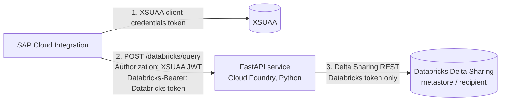

# Databricks Delta Sharing Connector (SAP BTP, Python)

A lightweight FastAPI service deployed on SAP BTP Cloud Foundry that acts as
a read-only proxy between **SAP Cloud Integration (CI)** and a Databricks
table shared via **Delta Sharing**.

The proxy authenticates CPI with an XSUAA-issued JWT. CPI supplies the
Databricks access token separately on each request in the `Databricks-Bearer`
header. The proxy validates the XSUAA token locally and uses only the
Databricks token for the Delta Sharing request.

## Why Delta Sharing, and why no Spark/JVM

Delta Sharing is an open REST protocol; Databricks additionally supports an
`oauth_client_credentials` profile type (Azure AD / Entra ID service
principal) for Databricks-hosted shares - exactly what was already proven
working in an earlier Groovy/Spark proof-of-concept using the Spark
connector (`delta-sharing-spark`).

That proof-of-concept ran a **local Spark context inside a Groovy step**,
which works but is heavy for CI's shared iFlow runtime. The open-source
**`delta-sharing` Python package** implements the same protocol directly
against **pandas** - no Spark, no JVM, no cluster required. Table data is
read via pre-signed HTTPS URLs returned by the Delta Sharing server, so
there's no Databricks compute cluster involved in serving a read.

## Architecture



1. CPI obtains an access token from the bound XSUAA service using a
   dedicated client-credentials service key.
2. CPI calls `POST /databricks/query` with the XSUAA JWT in
   `Authorization: Bearer <token>` and the raw Databricks access token in
   `Databricks-Bearer`.
3. The proxy validates the JWT signature against the bound XSUAA public
   signing keys and checks its issuer, audience, required scope, and CPI
   client ID. The XSUAA JWT is never forwarded to Databricks.
4. The Delta Sharing client uses the `Databricks-Bearer` value as its
   `bearer_token` profile credential. Databricks validates that token when
   the request is made; an invalid token surfaces as an HTTP 502.
5. The proxy applies an allow-listed column selection, filters, and a row
   limit in pandas (`app/query_builder.py`) and returns `{ columns, rows }`.

See [openapi.yaml](openapi.yaml) for the request/response schema (also
served live at `/docs` and `/openapi.json` via FastAPI).

## Project layout

```
app/
  main.py                  # FastAPI app, POST /databricks/query, GET /health
  auth.py                  # validates XSUAA JWTs and extracts Databricks-Bearer
  delta_sharing_client.py  # reads Delta Sharing data using the Databricks token
  query_builder.py         # allow-listed, injection-safe column/filter/limit logic
openapi.yaml               # OpenAPI 3.0 spec for the exposed API
xs-security.json           # XSUAA application, scope, and client authority
requirements.txt           # delta-sharing + FastAPI stack
Procfile                   # gunicorn/uvicorn start command (Cloud Foundry python_buildpack)
runtime.txt                # Python version pin
mta.yaml                   # Cloud Foundry multi-target app descriptor
```

## Setup

### 1. Prerequisites

- Python 3.11 (match `runtime.txt`) and `pip`
- Cloud Foundry CLI + `multiapps` plugin (`cf install-plugin multiapps`)
- A Databricks Delta Sharing endpoint URL (metastore/recipient path)
- An XSUAA service instance for this application
- The CPI client ID from its XSUAA service key; only this client ID (or
  explicitly configured additional IDs) is allowed to call the proxy

### 2. Install dependencies

```bash
python -m venv .venv && source .venv/bin/activate
pip install -r requirements.txt
```

Note: `delta-sharing` depends on `delta-kernel-rust-sharing-wrapper`, which
ships prebuilt wheels for common Linux/Python version combos. If pip tries
to build it from source on your platform, you'll additionally need a Rust
toolchain - stick to a mainstream Python version (e.g. 3.11 on Linux) to
avoid this.

### 3. Local development

For local development, provide the XSUAA values normally obtained from the
bound service and CPI service key:

```bash
export DELTA_SHARING_ENDPOINT=https://<workspace-host>/api/2.0/delta-sharing/metastores/<metastore-id>/recipients/<recipient-id>
export XSUAA_URL=https://<tenant>.authentication.<region>.hana.ondemand.com
export XSUAA_XSAPPNAME=databricks-connector
export XSUAA_ALLOWED_CLIENT_IDS=<CPI-XSUAA-client-id>
uvicorn app.main:app --reload
```

Call the endpoint with both tokens (the `Databricks-Bearer` value is the raw
Databricks token, without a `Bearer ` prefix):

```bash
curl -X POST http://localhost:8000/databricks/query \
  -H 'content-type: application/json' \
  -H 'Authorization: Bearer <xsuaa-access-token>' \
  -H 'Databricks-Bearer: <databricks-access-token>' \
  -d '{"share":"my_share","schema_name":"my_schema","table":"my_table","columns":"*","filters":"[{\"column\":\"region\",\"op\":\"=\",\"value\":\"EMEA\"}]","top":50}'
```

### 4. Create and configure the Cloud Foundry services

Create the Delta Sharing endpoint service:

```bash
cf create-user-provided-service databricks-connector-credentials -p \
  '{"DELTA_SHARING_ENDPOINT":"https://<workspace-host>/api/2.0/delta-sharing/metastores/<metastore-id>/recipients/<recipient-id>"}'
```

Create the XSUAA instance from the included security descriptor and create a
service key for CPI:

```bash
cf create-service xsuaa application databricks-connector-xsuaa -c xs-security.json
cf create-service-key databricks-connector-xsuaa databricks-connector-cpi
cf service-key databricks-connector-xsuaa databricks-connector-cpi
```

Use the service key's client ID and secret in CPI's OAuth2 client-credentials
artifact. Keep the secret in CPI; do not put it in the application
environment or source repository. The proxy is configured with the CPI
client ID separately using `XSUAA_ALLOWED_CLIENT_IDS`.

### 5. Deploy to Cloud Foundry

This repo is deployed with a plain `cf push` + `manifest.yml` (the `mbt`
build tool / `multiapps` plugin aren't required for this command).
`mta.yaml` is kept for reference if you switch to an MTA deploy later. Both
descriptors bind the app to the Delta Sharing credentials and XSUAA services.

```bash
cf push -f manifest.yml
cf set-env databricks-connector-xs XSUAA_ALLOWED_CLIENT_IDS '<CPI-client-id-from-service-key>'
cf restage databricks-connector-xs
```

Set `XSUAA_ALLOWED_CLIENT_IDS` to the CPI service key's client ID. Multiple
authorized client IDs can be comma-separated. Requests will return HTTP 503
until this setting is present.

### 6. Configure SAP Cloud Integration

1. Create an **OAuth2 Client Credentials** artifact using the XSUAA service
   key's client ID, client secret, and token endpoint (`url` plus
   `/oauth/token`). Request the `databricks-connector.Proxy` scope.
2. Configure the HTTP receiver adapter to use this artifact. CPI will send
   the resulting XSUAA JWT in `Authorization`.
3. In the iFlow, set `Databricks-Bearer` to the raw Databricks access token
   that CPI retrieved earlier. Do not put this token in `Authorization`;
   the proxy uses it only for the outbound Delta Sharing call.
4. Point the adapter at this app's `/databricks/query` URL, with the JSON
   body described in [openapi.yaml](openapi.yaml).

The query endpoint requires both headers. A missing/invalid XSUAA JWT returns
401; an authenticated but unapproved CPI client or missing scope returns
403. `/health` remains unauthenticated for platform liveness checks.

## Networking notes

- Delta Sharing's REST endpoint is reached over public HTTPS by default -
  no Cloud Connector is needed unless your workspace enforces private-link
  or IP allow-listing.
- If Databricks enforces IP allow-listing, add Cloud Foundry's outbound IP
  ranges to the allow-list.
- If Databricks is only reachable via a private network, add the
  `connectivity` service (commented out in `mta.yaml`) and route through an
  on-premise Cloud Connector virtual host instead of calling the host
  directly.
- Restrict inbound network access as defense in depth; the endpoint also
  validates the CPI XSUAA client ID and required scope.

## Extending

- **Predicate pushdown for large tables:** filters currently run
  client-side after fetching up to `MAX_FETCH_ROWS` (see
  `app/delta_sharing_client.py`). For much larger tables, pass validated,
  allow-listed conditions as Delta Sharing `predicateHints`/
  `jsonPredicateHints` as a server-side optimization - keep applying the
  same filter client-side afterward too, since pushdown is best-effort per
  the protocol spec.
- **Higher throughput / large result sets:** stream results in pages
  instead of materializing the full pandas DataFrame per request.
- **Multiple shares/workspaces:** parameterize `DELTA_SHARING_ENDPOINT` per
  request (with a strict allow-list) instead of a single fixed profile, if
  CPI needs to target more than one metastore/recipient.
