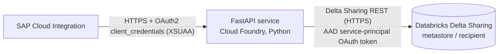

# Databricks Delta Sharing Connector (SAP BTP, Python)

A lightweight FastAPI service deployed on SAP BTP Cloud Foundry that acts as
a read-only proxy between **SAP Cloud Integration (CI)** and a Databricks
table shared via **Delta Sharing** - the connectivity option your
Databricks team supports (accessed through the officially supported
`delta-sharing` client library, per their "Spark libraries" policy).

## Why Delta Sharing, and why no Spark/JVM

Delta Sharing is an open REST protocol; Databricks additionally supports an
`oauth_client_credentials` profile type (Azure AD / Entra ID service
principal) for Databricks-hosted shares - exactly what was already proven
working in an earlier Groovy/Spark proof-of-concept using the Spark
connector (`delta-sharing-spark`).

That proof-of-concept ran a **local Spark context inside a Groovy step**,
which works but is heavy for CI's shared iFlow runtime. The open-source
**`delta-sharing` Python package** implements the same protocol and the same
`oauth_client_credentials` profile type directly against **pandas** - no
Spark, no JVM, no cluster required at all. Table data is read via
pre-signed HTTPS URLs returned by the Delta Sharing server, so there's no
Databricks compute cluster involved in serving a read.

## Architecture



1. **SAP CI** calls `POST /databricks/query` using an OAuth2 Client
   Credentials token issued by the app's **XSUAA** service instance,
   scoped to `DatabricksReader`.
2. The service validates the token and required scope (`app/auth.py`,
   via `sap-xssec`).
3. It reads the requested `share.schema.table` via the `delta-sharing`
   client (`app/delta_sharing_client.py`), authenticating with the Azure AD
   (Entra ID) service principal your Databricks team already provisioned -
   the client acquires the OAuth token itself using the
   `oauth_client_credentials` profile.
4. It applies an allow-listed column selection, filters, and a row limit
   entirely client-side in pandas (`app/query_builder.py`) - filter values
   are evaluated with pandas boolean indexing, never turned into a query
   string, so there is no SQL/predicate-injection surface.
5. The result (`{ columns, rows }`) is returned as JSON to CI.

## Project layout

```
app/
  main.py                  # FastAPI app, POST /databricks/query, GET /health
  auth.py                   # XSUAA JWT validation (sap-xssec)
  delta_sharing_client.py   # builds the Delta Sharing profile and reads a table into pandas
  query_builder.py          # allow-listed, injection-safe column/filter/limit logic
requirements.txt             # delta-sharing + FastAPI stack
Procfile                     # gunicorn/uvicorn start command (Cloud Foundry python_buildpack)
runtime.txt                   # Python version pin
xs-security.json              # XSUAA scope/role for the CI OAuth2 client
mta.yaml                      # Cloud Foundry multi-target app descriptor
```

## Setup

### 1. Prerequisites
- Python 3.11 (match `runtime.txt`) and `pip`
- Cloud Foundry CLI + `multiapps` plugin (`cf install-plugin multiapps`)
- The Delta Sharing **endpoint URL** (metastore/recipient path, provided by
  your Databricks team)
- The Entra ID (Azure AD) app registration's **client id, client secret,
  tenant id / token endpoint, and scope** your Databricks team already
  uses for Delta Sharing access

### 2. Install dependencies
```bash
python -m venv .venv && source .venv/bin/activate
pip install -r requirements.txt
```
Note: `delta-sharing` depends on `delta-kernel-rust-sharing-wrapper`, which
ships prebuilt wheels for common Linux/Python version combos. If pip tries
to build it from source on your platform, you'll additionally need a Rust
toolchain - stick to a mainstream Python version (e.g. 3.11 on linux) to
avoid this.

### 3. Local development
```bash
export AUTH_DISABLED=true   # skip XSUAA validation locally only
export DELTA_SHARING_ENDPOINT=https://<workspace-host>/api/2.0/delta-sharing/metastores/<metastore-id>/recipients/<recipient-id>
export AZURE_TOKEN_ENDPOINT=https://login.microsoftonline.com/<tenant-id>/oauth2/v2.0/token
export AZURE_CLIENT_ID=<entra-app-client-id>
export AZURE_CLIENT_SECRET=<entra-app-client-secret>
export AZURE_SCOPE=<client-id>/.default
uvicorn app.main:app --reload
```
Then call, e.g.:
```bash
curl -X POST http://localhost:8000/databricks/query \
  -H 'content-type: application/json' \
  -d '{"share":"my_share","schema_name":"my_schema","table":"my_table","columns":"*","filters":"[{\"column\":\"region\",\"op\":\"=\",\"value\":\"EMEA\"}]","top":50}'
```

### 4. Provide credentials for the deployed app
Create a user-provided service **before** deploying the MTA (referenced as
an `existing-service` resource in `mta.yaml`, so the client secret is never
committed to this repo):
```bash
cf create-user-provided-service databricks-connector-credentials -p \
  '{"DELTA_SHARING_ENDPOINT":"https://<workspace-host>/api/2.0/delta-sharing/metastores/<metastore-id>/recipients/<recipient-id>","AZURE_TOKEN_ENDPOINT":"https://login.microsoftonline.com/<tenant-id>/oauth2/v2.0/token","AZURE_CLIENT_ID":"...","AZURE_CLIENT_SECRET":"...","AZURE_SCOPE":"<client-id>/.default"}'
```
For stronger secret handling, replace this with the BTP **Credential
Store** service and read the secret from there instead of a plain UPS.

> Never commit real Delta Sharing / Azure AD credentials to source control.
> Secrets belong only in the bound user-provided service (or a proper
> Credential Store), never in files tracked by git.

### 5. Deploy to Cloud Foundry
This repo is deployed with a plain `cf push` + `manifest.yml` (the `mbt`
build tool / `multiapps` plugin aren't installed in this environment).
`mta.yaml` is kept for reference if you switch to a full MTA deploy later.

```bash
cf create-service xsuaa application databricks-connector-xsuaa -c xs-security.json   # if not already created
cf create-user-provided-service databricks-connector-credentials -p '{...}'          # see step 4 above
cf push -f manifest.yml
```

### 6. Wire up SAP Cloud Integration
1. In the BTP subaccount, create an OAuth2 client for CI against the app's
   XSUAA instance (or assign the `DatabricksConnectorReader` role
   collection to an existing service-to-service client).
2. In CI, configure the HTTP receiver adapter with OAuth2 Client
   Credentials, pointing at the XSUAA token endpoint and the deployed
   app's `/databricks/query` URL.

## Networking notes
- Delta Sharing's REST endpoint and Azure AD's token endpoint are reached
  over public HTTPS by default - no Cloud Connector needed unless your
  workspace enforces private-link/IP allow-listing.
- If Databricks enforces IP allow-listing, add Cloud Foundry's outbound IP
  ranges to the allow-list.
- If Databricks is only reachable via a private network, add the
  `connectivity` service (commented out in `mta.yaml`) and route through
  an on-premise Cloud Connector virtual host instead of calling the host
  directly.

## Extending
- **Predicate pushdown for large tables:** filters currently run
  client-side after fetching up to `MAX_FETCH_ROWS` (see
  `app/delta_sharing_client.py`). For much larger tables, pass validated,
  allow-listed conditions as Delta Sharing `predicateHints`/`jsonPredicateHints`
  as a server-side optimization - keep applying the same filter client-side
  afterward too, since pushdown is best-effort per the protocol spec.
- **Higher throughput / large result sets:** stream results in pages
  instead of materializing the full pandas DataFrame per request.
- **Multiple shares/workspaces:** parameterize `DELTA_SHARING_ENDPOINT` per
  request (with a strict allow-list) instead of a single fixed profile, if
  CI needs to target more than one metastore/recipient.
