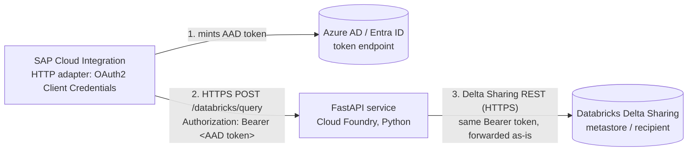

# Databricks Delta Sharing Connector (SAP BTP, Python)

A lightweight FastAPI service deployed on SAP BTP Cloud Foundry that acts as
a read-only proxy between **SAP Cloud Integration (CI)** and a Databricks
table shared via **Delta Sharing** - the connectivity option your
Databricks team supports (accessed through the officially supported
`delta-sharing` client library, per their "Spark libraries" policy).

Credential ownership: this app **never stores or requests** any
Databricks/Azure AD client id or secret. SAP CI's own HTTP receiver adapter
holds those credentials and mints the OAuth access token itself; this app
only ever handles the short-lived token CI forwards to it (see
[Architecture](#architecture) below).

## Why Delta Sharing, and why no Spark/JVM

Delta Sharing is an open REST protocol; Databricks additionally supports an
`oauth_client_credentials` profile type (Azure AD / Entra ID service
principal) for Databricks-hosted shares - exactly what was already proven
working in an earlier Groovy/Spark proof-of-concept using the Spark
connector (`delta-sharing-spark`).

That proof-of-concept ran a **local Spark context inside a Groovy step**,
which works but is heavy for CI's shared iFlow runtime. The open-source
**`delta-sharing` Python package** implements the same protocol and the same
`oauth_client_credentials` profile type directly against **pandas** - no
Spark, no JVM, no cluster required at all. Table data is read via
pre-signed HTTPS URLs returned by the Delta Sharing server, so there's no
Databricks compute cluster involved in serving a read.

## Architecture



1. **SAP CI**'s HTTP receiver adapter is configured with an OAuth2 Client
   Credentials artifact (client id/secret/token endpoint/scope for the
   Databricks Delta Sharing recipient's Entra ID service principal) and
   mints its own Azure AD access token before each call.
2. CI calls `POST /databricks/query` with that token as a normal
   `Authorization: Bearer <token>` header. This app only extracts the
   token (`app/auth.py`) - it does not validate it locally, since it never
   has the client secret needed to do so meaningfully.
3. It reads the requested `share.schema.table` via the `delta-sharing`
   client (`app/delta_sharing_client.py`), using the **forwarded token
   directly** as a Delta Sharing `bearer_token` (v1) profile credential -
   no separate OAuth exchange happens in this app.
4. Databricks validates the token's signature, audience, scope and expiry
   itself; an invalid/expired token simply fails the Delta Sharing request
   (surfaced by this app as an HTTP 502), so there's no local
   authentication logic to get wrong.
5. It applies an allow-listed column selection, filters, and a row limit
   entirely client-side in pandas (`app/query_builder.py`) - filter values
   are evaluated with pandas boolean indexing, never turned into a query
   string, so there is no SQL/predicate-injection surface.
6. The result (`{ columns, rows }`) is returned as JSON to CI.

See [openapi.yaml](openapi.yaml) for the full request/response schema (also
served live at `/docs` and `/openapi.json` via FastAPI).

## Project layout

```
app/
  main.py                  # FastAPI app, POST /databricks/query, GET /health
  auth.py                   # extracts the CI-forwarded bearer token (no local validation)
  delta_sharing_client.py   # uses the forwarded token as a Delta Sharing bearer_token profile
  query_builder.py          # allow-listed, injection-safe column/filter/limit logic
openapi.yaml                  # OpenAPI 3.0 spec for the exposed API
requirements.txt             # delta-sharing + FastAPI stack
Procfile                     # gunicorn/uvicorn start command (Cloud Foundry python_buildpack)
runtime.txt                   # Python version pin
mta.yaml                      # Cloud Foundry multi-target app descriptor
```

## Setup

### 1. Prerequisites
- Python 3.11 (match `runtime.txt`) and `pip`
- Cloud Foundry CLI + `multiapps` plugin (`cf install-plugin multiapps`)
- The Delta Sharing **endpoint URL** (metastore/recipient path, provided by
  your Databricks team) - this is the only configuration this app needs;
  it is not secret (just a URL), but is still supplied via a bound service
  rather than hardcoded
- For **local testing only**: an Azure AD access token for the same
  service principal/scope CI will use (e.g. obtained with `curl` against
  the tenant's OAuth2 token endpoint using the client id/secret your
  Databricks team provisioned) - this app does not mint tokens itself

### 2. Install dependencies
```bash
python -m venv .venv && source .venv/bin/activate
pip install -r requirements.txt
```
Note: `delta-sharing` depends on `delta-kernel-rust-sharing-wrapper`, which
ships prebuilt wheels for common Linux/Python version combos. If pip tries
to build it from source on your platform, you'll additionally need a Rust
toolchain - stick to a mainstream Python version (e.g. 3.11 on linux) to
avoid this.

### 3. Local development
```bash
export DELTA_SHARING_ENDPOINT=https://<workspace-host>/api/2.0/delta-sharing/metastores/<metastore-id>/recipients/<recipient-id>
uvicorn app.main:app --reload
```
Then call, e.g. (substitute a real Azure AD access token obtained as
described in Prerequisites above):
```bash
curl -X POST http://localhost:8000/databricks/query \
  -H 'content-type: application/json' \
  -H 'Authorization: Bearer <azure-ad-access-token>' \
  -d '{"share":"my_share","schema_name":"my_schema","table":"my_table","columns":"*","filters":"[{\"column\":\"region\",\"op\":\"=\",\"value\":\"EMEA\"}]","top":50}'
```

### 4. Provide configuration for the deployed app
Create a user-provided service **before** deploying (referenced as an
`existing-service` resource in `mta.yaml`):
```bash
cf create-user-provided-service databricks-connector-credentials -p \
  '{"DELTA_SHARING_ENDPOINT":"https://<workspace-host>/api/2.0/delta-sharing/metastores/<metastore-id>/recipients/<recipient-id>"}'
```
No Azure AD client id/secret is stored here (or anywhere in this app) -
those live only in SAP CI's OAuth2 Client Credentials artifact.

### 5. Deploy to Cloud Foundry
This repo is deployed with a plain `cf push` + `manifest.yml` (the `mbt`
build tool / `multiapps` plugin aren't installed in this environment).
`mta.yaml` is kept for reference if you switch to a full MTA deploy later.

```bash
cf create-user-provided-service databricks-connector-credentials -p '{...}'   # see step 4 above
cf push -f manifest.yml
```

### 6. Configure SAP Cloud Integration
1. In CI, create an **OAuth2 Client Credentials** artifact (Security
   Material) holding the Databricks Delta Sharing recipient's Entra ID
   **client id, client secret, token endpoint, and scope** (the same
   values your Databricks team already provisioned).
2. Configure the **HTTP receiver adapter** on the iFlow step that calls
   this app to use that OAuth2 Client Credentials artifact - CI will mint
   the token itself and set the `Authorization: Bearer <token>` header
   automatically on each call.
3. Point the adapter at this app's `/databricks/query` URL, with the JSON
   body described in [openapi.yaml](openapi.yaml).

> Since this app forwards whatever bearer token it receives straight to
> Databricks without local validation, treat network reachability to
> `/databricks/query` as part of your access control boundary (see
> Networking notes below) - anyone who can reach the endpoint with *some*
> bearer token can attempt a Delta Sharing call, though only a token valid
> for the Databricks recipient will actually succeed.

## Networking notes
- Delta Sharing's REST endpoint is reached over public HTTPS by default -
  no Cloud Connector needed unless your workspace enforces private-link/IP
  allow-listing.
- If Databricks enforces IP allow-listing, add Cloud Foundry's outbound IP
  ranges to the allow-list.
- If Databricks is only reachable via a private network, add the
  `connectivity` service (commented out in `mta.yaml`) and route through
  an on-premise Cloud Connector virtual host instead of calling the host
  directly.
- Consider restricting inbound access to `/databricks/query` (e.g. a CF
  route service, IP allow-list, or mutual TLS) since this app no longer
  performs its own caller authentication - it relies entirely on
  Databricks rejecting invalid forwarded tokens.

## Extending
- **Predicate pushdown for large tables:** filters currently run
  client-side after fetching up to `MAX_FETCH_ROWS` (see
  `app/delta_sharing_client.py`). For much larger tables, pass validated,
  allow-listed conditions as Delta Sharing `predicateHints`/`jsonPredicateHints`
  as a server-side optimization - keep applying the same filter client-side
  afterward too, since pushdown is best-effort per the protocol spec.
- **Higher throughput / large result sets:** stream results in pages
  instead of materializing the full pandas DataFrame per request.
- **Multiple shares/workspaces:** parameterize `DELTA_SHARING_ENDPOINT` per
  request (with a strict allow-list) instead of a single fixed profile, if
  CI needs to target more than one metastore/recipient.
